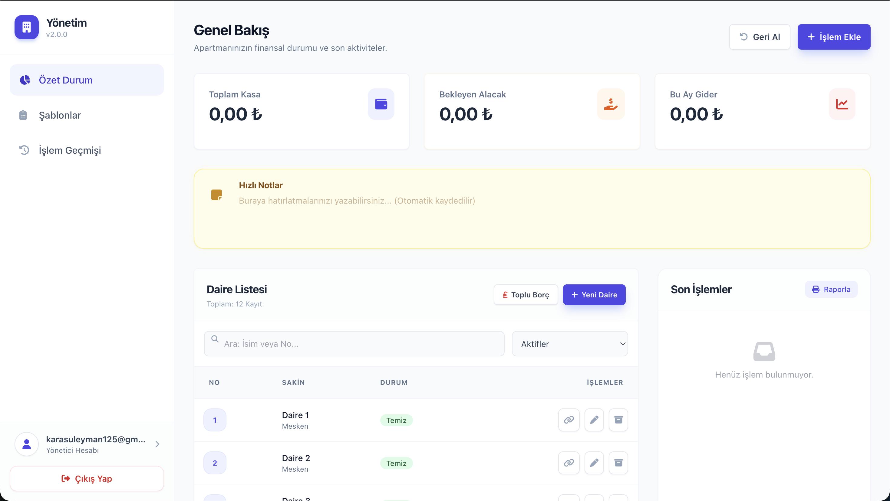

# ras-template

A web-based application designed for apartment and residential complex managers to track dues, manage income and expenses, and communicate with residents.

## Website

[Live Demo](https://ras-template.web.app/)

## Features
- Apartment and Resident Management
- Dues and Debt Tracking
- Income and Expense Management
- Excel Reporting
- Mobile-Responsive Interface

## Technologies Used
- HTML5, Vanilla JavaScript, Tailwind CSS
- Firebase (Authentication, Firestore, Hosting)

---

## ⚠️ Developer Notes & Lessons Learned

*Note: This section documents the architectural and technical mistakes made during the development of this older project.*

- **No Framework:** I used a structure without any templates or frontend frameworks. Trying to manage the entire application state and UI flow with pure Vanilla JavaScript was a huge mistake.
- **Backend Choice:** I relied completely on Firebase as the backend directly from the client side, without a dedicated server architecture.
- **Spaghetti Code:** The combination of pure JS DOM manipulation and direct database calls inevitably resulted in unmaintainable "spaghetti" code.

**Key Takeaway:** 
I realized that applications of this type must be properly architected and schematized beforehand. They should be written with appropriate languages and it is absolutely essential to use modern frameworks to keep the codebase maintainable and scalable.
