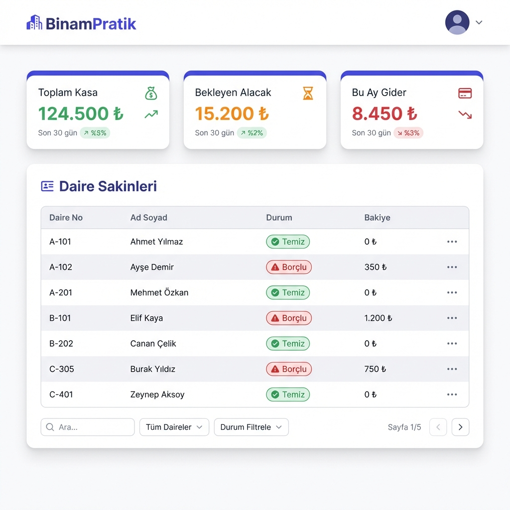

# BinamPratik - Açık Kaynak Apartman Yönetim Sistemi 🏢

**BinamPratik**, apartman ve site yöneticileri için geliştirilmiş; aidat takibi, gelir-gider yönetimi ve sakin iletişimini kolaylaştıran **tamamen ücretsiz ve açık kaynaklı** bir web uygulamasıdır.

Modern arayüzü, gelişmiş özellikleri ve kolay kurulumu ile Excel dosyalarıyla uğraşmanıza son verir.



## 🌟 Özellikler

- **🏠 Daire & Sakin Yönetimi:** Sınırsız sayıda daire ve sakin ekleyin.
- **💰 Aidat Takibi:** Borçlandırma ve tahsilat işlemlerini tek tıkla yapın.
- **📊 Gelir & Gider Yönetimi:** Apartman kasasını anlık olarak takip edin.
- **📈 Finansal Raporlar:** Aylık ve yıllık raporları Excel formatında dışa aktarın.
- **🔒 Güvenli Altyapı:** Verileriniz Google Cloud üzerinde güvenle saklanır.
- **📱 Mobil Uyumlu:** Telefon, tablet ve bilgisayardan erişilebilir.

## 🚀 Teknolojiler

Bu proje, modern web teknolojileri kullanılarak geliştirilmiştir:

- **Frontend:** HTML5, JavaScript (ES6+), Tailwind CSS (Build Process)
- **Backend / Database:** Firebase (Authentication, Firestore)
- **Hosting:** Firebase Hosting

## 💸 Ücretsiz Kullanım (Firebase Spark Planı)

Bu proje **Firebase Spark Planı (Ücretsiz)** sınırları dahilinde çalışacak şekilde tasarlanmıştır. Herhangi bir sunucu maliyeti olmadan kendi apartmanınız için kullanabilirsiniz.

**Ücretsiz Plan Kapsamı:**
- **Hosting:** 10 GB depolama, 360 MB/gün bant genişliği.
- **Firestore (Veritabanı):** 1 GB depolama, günlük 50.000 okuma / 20.000 yazma. (Ortalama bir apartman için fazlasıyla yeterli)
- **Authentication:** Aylık 50.000 aktif kullanıcı.

*Not: Projede maliyet oluşturabilecek sunucu tabanlı fonksiyonlar (Cloud Functions) **KULLANILMAMIŞTIR**. Tamamen istemci taraflı (Client-side) çalışır.*

## 🛠️ Kurulum (Geliştiriciler İçin)

Projeyi kendi bilgisayarınızda çalıştırmak veya geliştirmek isterseniz:

1.  **Projeyi Klonlayın:**
    ```bash
    git clone https://github.com/slmnkara/sk-ras.git
    cd sk-ras
    ```

2.  **Bağımlılıkları Yükleyin:**
    Tailwind CSS derlemesi için gereklidir.
    ```bash
    npm install
    ```

3.  **Firebase Projesi Oluşturun:**
    [Firebase Console](https://console.firebase.google.com)'dan yeni bir proje oluşturun ve `Authentication` (Email/Password) ile `Firestore` servislerini aktifleştirin.

4.  **Konfigürasyonu Ayarlayın:**
    `public/src/js/config.js` dosyasını kendi Firebase bilgilerinizle güncelleyin.

5.  **Geliştirme Sunucusunu Başlatın:**
    ```bash
    npm run dev:css  # CSS izleme modu
    firebase serve   # Yerel sunucu
    ```

## 📝 Lisans

Bu proje [MIT Lisansı](LICENSE) ile lisanslanmıştır. Özgürce kullanabilir, değiştirebilir ve dağıtabilirsiniz.

---
**Geliştirici:** Süleyman Kara